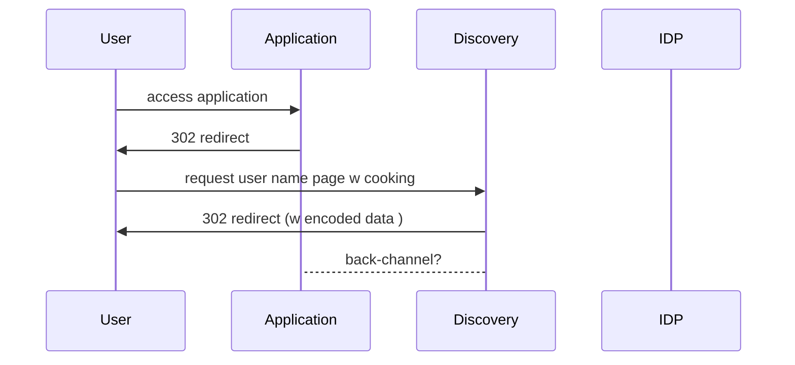

```mermaid
  graph TD;
      A-->B;
      A-->C;
      B-->D;
      C-->D;
```

## Discovery Logic

## Sequence diagram

```mermaid
sequenceDiagram
    participant User
    participant Application
    participant Discovery
    participant IDP
    User->>Application : access application 
    Application->>User : 302 redirect 
    User->>Discovery : request user name page w cooking
    Discovery->>User: 302 redirect (w encoded data )
    Discovery-->Application: back-channel?
```
